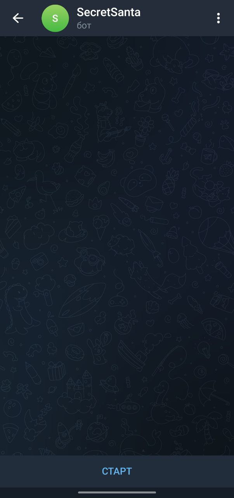
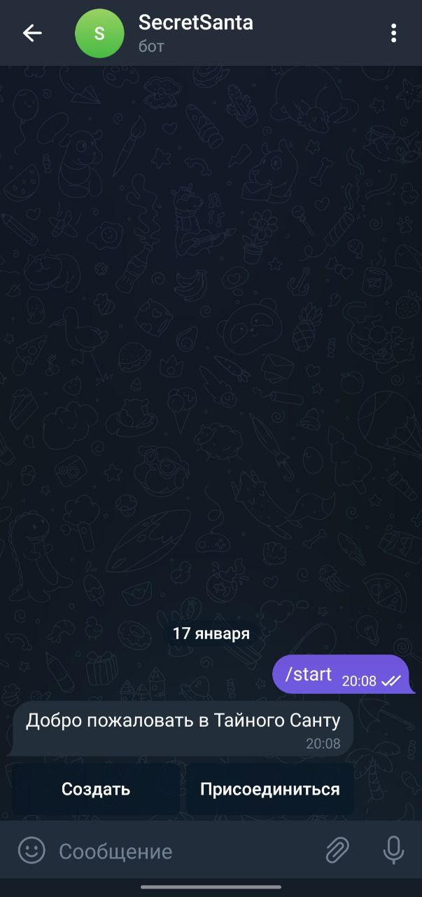
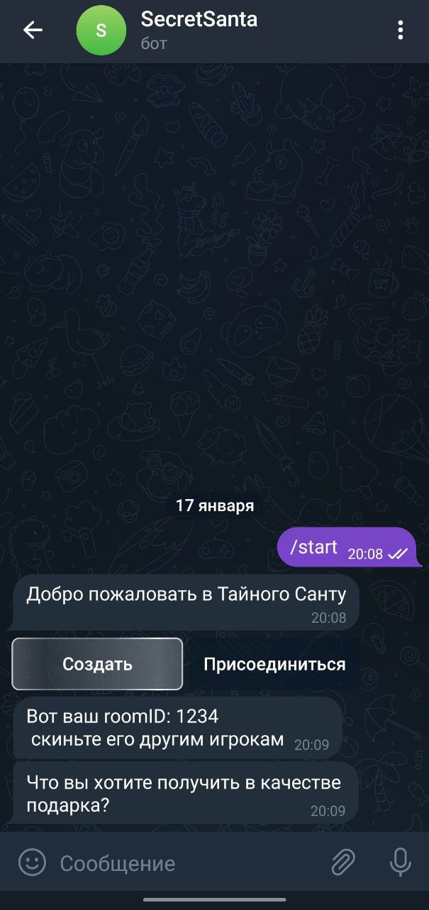
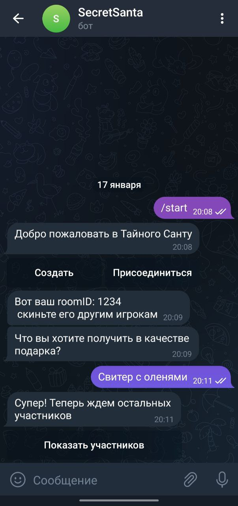
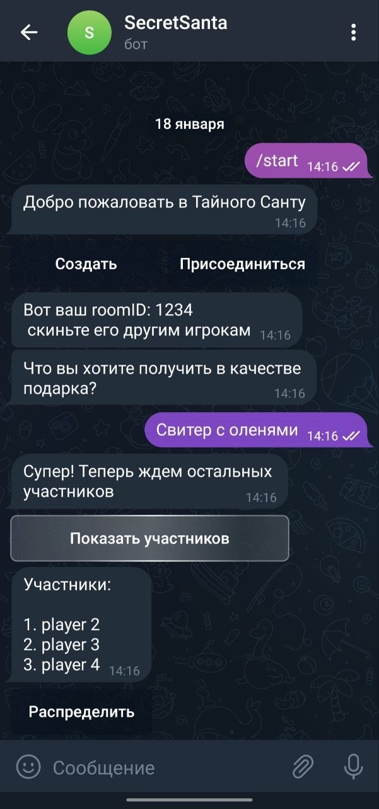
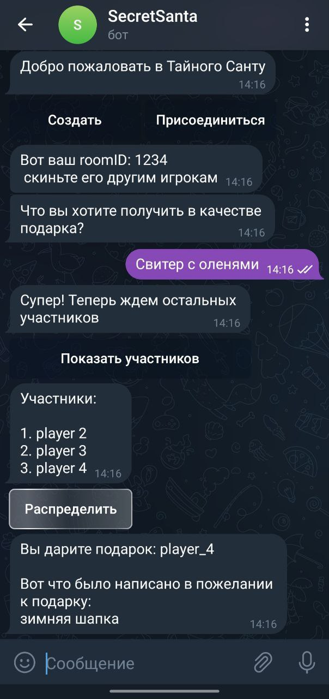
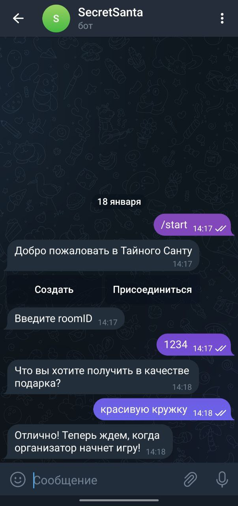

## Secret santa bot

Telegram bot for exchanging Christmas gifts 
You can find this bot in telegram - @secret_snta_bot

### Stack
- Go
- Postgres
- Redis

### How to use it
**First of all you start the bot and create the game if you want to be an organizer**

**Next, you write what you want to receive as a gift and wait for the rest of the players. You can find out who has already entered the room using a special button. When all the players are in the room, you can distribute all the players. Then all players will receive a message about who they are giving a gift to and what the recipient wants.**

**If you are not the organizer, you only need to enter the ID of the "game room", write your wishlist and wait for the organizer to start the game.**

